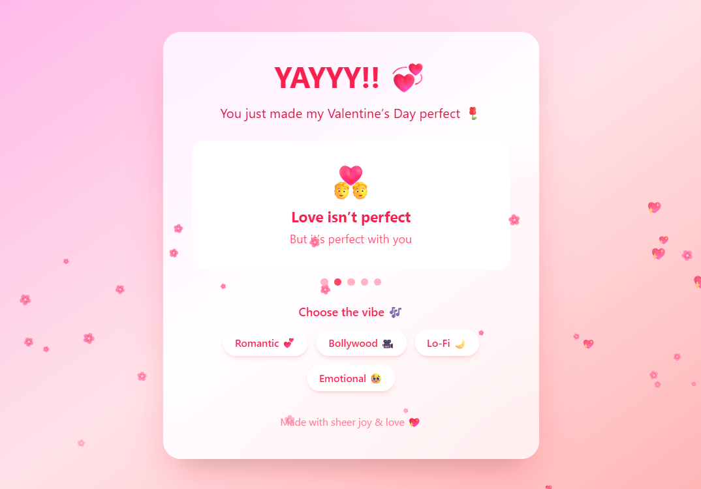

# 💖 Valentine Proposal Web App

A playful, romantic, and interactive Valentine’s Day web experience built with **React**, **Tailwind CSS**, and **Framer Motion**.  
Designed to be cute, emotional, mischievous, and impossible to say no 💘

---
## 📸 Screenshots

### 💌 Proposal Screen

### 🎉 Celebration Mode

### 🎶 Music & Slideshow

---

## 🌸 Features

- 💌 Interactive Yes / No proposal
    - “No” button playfully escapes
    - “Yes” button grows with excitement
- 🌸 Floating hearts & blossom animations
- 🎉 Celebration screen with smooth transitions
- 🖼️ Animated slideshow with romantic & fun messages
- 🎶 Music vibes selector (Play / Pause supported)
- 🔊 Celebration sound on acceptance
- 📱 Fully responsive & mobile-friendly
- 🚀 Deployed on GitHub Pages

---

## 🧠 Tech Stack
- **React (Vite)**
- **Tailwind CSS**
- **Framer Motion**
- **Web Audio API**
- **GitHub Pages (Deployment)**

---
## ❤️ Inspired by viral Valentine proposal websites — but built with:
- Better animations
- Real music control
- Cleaner UI
- Modern frontend practices

---
# If it made someone smile, laugh, or say YES — it did its job 💕